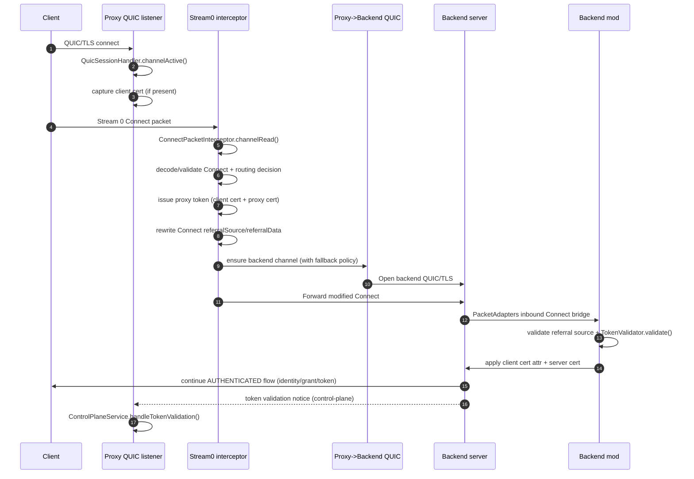
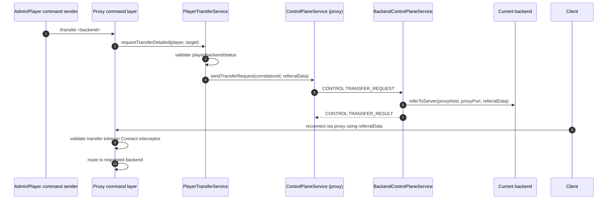
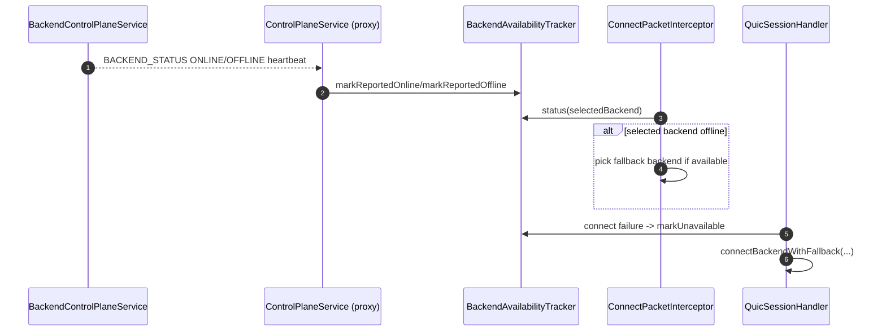

# Proxy Auth, Join and Transfer Flow (v0.4.0)

This document describes the runtime flow exactly as implemented in `proxy` and `backend-mod`.

## Source of truth

- `proxy/src/main/kotlin/ru/hytalemodding/lineage/proxy/net/QuicSessionHandler.kt`
- `proxy/src/main/kotlin/ru/hytalemodding/lineage/proxy/net/handler/ConnectPacketInterceptor.kt`
- `proxy/src/main/kotlin/ru/hytalemodding/lineage/proxy/net/handler/StreamBridge.kt`
- `proxy/src/main/kotlin/ru/hytalemodding/lineage/proxy/control/ControlPlaneService.kt`
- `proxy/src/main/kotlin/ru/hytalemodding/lineage/proxy/player/PlayerTransferService.kt`
- `proxy/src/main/kotlin/ru/hytalemodding/lineage/proxy/net/BackendAvailabilityTracker.kt`
- `backend-mod/src/main/kotlin/ru/hytalemodding/lineage/backend/LineageBackendMod.kt`
- `backend-mod/src/main/kotlin/ru/hytalemodding/lineage/backend/security/TokenValidator.kt`
- `backend-mod/src/main/kotlin/ru/hytalemodding/lineage/backend/control/BackendControlPlaneService.kt`

## 1. Initial join and authenticated handshake

Key implementation points:

- Stream `0` interception and packet rewrite: `ConnectPacketInterceptor`.
- Proxy token injection: `TokenService.issueToken(...)` from `ConnectPacketInterceptor`.
- Backend cert policy and ALPN checks before stream bridge: `QuicSessionHandler.connectBackend(...)`.
- Final backend-side validation and cert context apply: `LineageBackendMod.registerHandshakeBridge()` + `LineageBackendMod.onPlayerConnect()`.

## 2. Server transfer flow (`/transfer`)

Key implementation points:

- Command entry: `TransferCommand.execute(...)`.
- Transfer request orchestration: `PlayerTransferService.requestTransferDetailed(...)`.
- Control-plane encode/send/verify: `ControlPlaneService` and `BackendControlPlaneService`.
- Transfer token consume path: `ConnectPacketInterceptor.resolveBackend(...)`.

## 3. Backend status, fallback and reconnect behavior

Key implementation points:

- Backend status heartbeats and offline burst on stop: `BackendControlPlaneService.start()/stop()`.
- Proxy status ingestion and state update: `ControlPlaneService.handleBackendStatus(...)`.
- Connect-time reroute + connect-time fallback retries: `ConnectPacketInterceptor.resolveBackend(...)` and `QuicSessionHandler.connectBackendWithFallback(...)`.

## 4. Security invariants enforced by this flow

- Backend token validation is never bypassed; backend validates referral token and context.
- Proxy and backend control-plane messages are envelope-validated (sender/time/ttl/nonce replay/payload limits).
- Backend selection for join/transfer is bounded by availability tracker and deterministic fallback logic.
- Stream bridging starts only after backend channel and handshake path are in a valid state.
