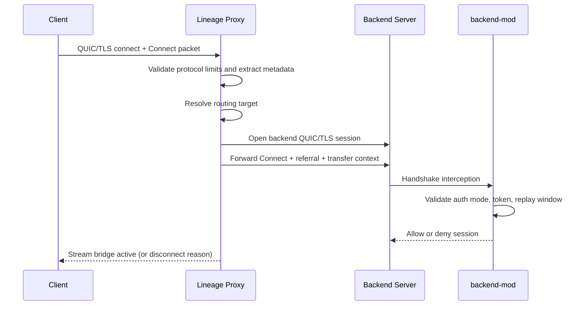

# Lineage Proxy

<p>
  <b>English</b> | <a href="readme_ru.md">Русский</a>
</p>

[)](https://central.sonatype.com/artifact/ru.hytalemodding.lineage/api)
[)](https://central.sonatype.com/artifact/ru.hytalemodding.lineage/shared)
[](https://kotlinlang.org/)

Lineage is a QUIC/TLS proxy for Hytale that preserves the official AUTHENTICATED flow while giving full control over routing, transfers, command bridge, and operational policy.

> [!WARNING]
> Work in progress. APIs and runtime behavior may still change before stable 1.x.

## Community

- Telegram: https://t.me/hytalemoddingru
- Reddit: https://www.reddit.com/r/hytalemoddingru/
- Discord: https://discord.gg/Smt798UNk9
- Modding docs: https://lineage.hytalemodding.ru

## Table of contents

- [Project overview](#project-overview)
- [Core features](#core-features)
- [Repository structure](#repository-structure)
- [For server admins](#for-server-admins)
- [For modders](#for-modders)
- [For contributors](#for-contributors)
- [Support](#support)

## Project overview

Lineage consists of two runtime components:

- `proxy`: QUIC listener, routing, command layer, observability, localization, text rendering, mod loader.
- `backend-mod`: strict backend-side enforcement and control-plane integration.

Connection path:

1. Client opens QUIC/TLS to `proxy`.
2. Proxy captures Connect (stream `0`) and validates protocol constraints.
3. Routing selects backend.
4. Proxy injects referral and signed transfer context.
5. Backend-mod validates auth-mode, token constraints, replay policy, and referral source.

Control plane:

- Authenticated UDP messaging between proxy and backend-mod.
- Strict envelope checks: sender, timestamp, ttl, nonce replay, payload size.
- Backend availability signals are used by transfer and fallback behavior.



## Core features

- Security-first by default:
  - strict config validation and fail-fast startup,
  - replay protection for transfer/control messages,
  - no token/secret logging,
  - authenticated backend enforcement.
- Operational resilience:
  - startup-order tolerant backend command sync,
  - backend availability tracking,
  - fallback routing on transfer/connect failures,
  - observability endpoints (`/health`, `/status`, `/metrics`).
- Admin UX:
  - proxy commands (`help`, `transfer`, `list`, `info`, `ping`, `perm`, `mod`, `messages reload`, `stop`),
  - console history + log archives (limits configurable).
- Modding UX:
  - stable API modules (`api`, `shared`),
  - `LocalizationService` + `TextRendererService`,
  - bounded color/markup renderer with HEX and gradients.

## Repository structure

- `proxy/` - Lineage proxy runtime.
- `backend-mod/` - backend enforcement plugin.
- `api/` - public API for proxy mods.
- `shared/` - shared protocol/token/logging primitives.
- `docs/modding/` - modding and operations documentation.

## For server admins

### 1. Download (recommended)

Download prebuilt artifacts from GitHub Releases:

- Latest release: https://github.com/hytalemoddingru/lineage/releases/latest
- All releases: https://github.com/hytalemoddingru/lineage/releases

Required files:

- `lineage-proxy-<version>.jar`
- `lineage-backend-mod-<version>.jar`

### 2. Install

- Proxy:

```bash
java -jar lineage-proxy-<version>.jar
```

- Backend mod:
  copy `lineage-backend-mod-<version>.jar` into each backend server `mods/` directory.

### 3. Configure

Proxy runtime files:

- `config.toml`
- `messages/*.toml`
- `styles/rendering.toml`
- `.consolehistory`
- `logs/`

Must match between proxy and backend-mod:

- `security.proxy_secret` <-> backend `proxy_secret`
- `messaging.host` / `messaging.port` <-> backend `messaging_host` / `messaging_port`
- `messaging.enabled` <-> backend `messaging_enabled`
- `referral.host` / `referral.port` <-> backend expected referral source

Backend-mod dependency note:

- `backend-mod` resolves Hytale server classes via Maven:
  - repository: `https://maven.hytale.com/release`
  - dependency: `com.hypixel.hytale:Server:<version>`
  - version source: `hytaleServerVersion` in `gradle.properties`

### 4. Operate

Quick checks:

1. Verify `/health`, `/status`, `/metrics`.
2. Restart one backend while players are online and confirm fallback behavior.
3. Test startup-order resilience: start backends first, then proxy.
4. Reload text/localization files via `messages reload`.

Detailed operations docs:

- `docs/modding/operations-runbook.md`
- `docs/modding/logging-ux.md`
- `docs/modding/security-invariants.md`
- `docs/modding/proxy-auth-routing-flow.md`

### 5. Build from source (optional)

If you prefer local builds instead of GitHub release artifacts:

```bash
./gradlew :proxy:shadowJar :backend-mod:shadowJar
```

## For modders

Public docs index:

- `docs/modding/index.md`

Key guides:

- `docs/modding/getting-started.md`
- `docs/modding/services.md`
- `docs/modding/commands.md`
- `docs/modding/events.md`
- `docs/modding/localization-text.md`

Dependencies:

### Gradle Kotlin DSL

```kotlin
dependencies {
    implementation("ru.hytalemodding.lineage:api:0.4.0")
    implementation("ru.hytalemodding.lineage:shared:0.4.0")
}
```

### Gradle Groovy DSL

```groovy
dependencies {
    implementation "ru.hytalemodding.lineage:api:0.4.0"
    implementation "ru.hytalemodding.lineage:shared:0.4.0"
}
```

### Maven

```xml
<dependencies>
  <dependency>
    <groupId>ru.hytalemodding.lineage</groupId>
    <artifactId>api</artifactId>
    <version>0.4.0</version>
  </dependency>
  <dependency>
    <groupId>ru.hytalemodding.lineage</groupId>
    <artifactId>shared</artifactId>
    <version>0.4.0</version>
  </dependency>
</dependencies>
```

## For contributors

- Read: `contributing.md`
- Conduct: `code_of_conduct.md`
- Keep changes small, test-covered, and documented in `docs/modding/` when API/behavior changes.

Local validation:

```bash
./gradlew test
```

Release build validation:

```bash
./gradlew :proxy:shadowJar :backend-mod:shadowJar
```

## Support

- USDT (TRC20): `TA27e9E1hqB3iGJhf4FNp1U4FP9rWVF7HL`
- RU card (MIR): `2200 7017 1528 7212`
- Payment link: https://pay.cloudtips.ru/p/fc42043c

by [@amanomasato](https://github.com/amanomasato) supported by [@hytalemoddingru](https://github.com/hytalemoddingru)
