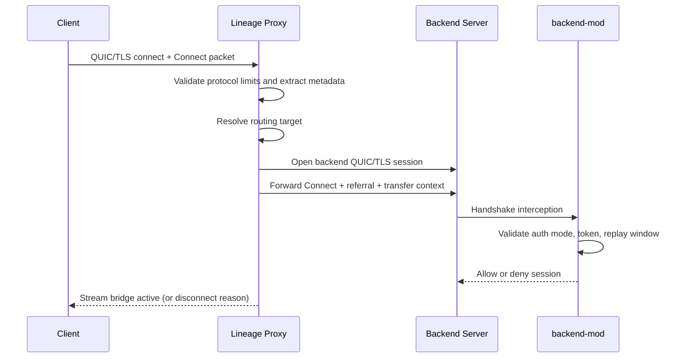

# Lineage Proxy

<p>
  <a href="readme.md">English</a> | <b>Русский</b>
</p>

[)](https://central.sonatype.com/artifact/ru.hytalemodding.lineage/api)
[)](https://central.sonatype.com/artifact/ru.hytalemodding.lineage/shared)
[](https://kotlinlang.org/)

Lineage — это QUIC/TLS proxy для Hytale, который сохраняет официальный AUTHENTICATED flow и при этом даёт полный контроль над роутингом, transfer, command bridge и operational policy.

> [!WARNING]
> Проект в активной разработке. API и поведение рантайма могут измениться до стабильной 1.x.

## Сообщество

- Telegram: https://t.me/hytalemoddingru
- Reddit: https://www.reddit.com/r/hytalemoddingru/
- Discord: https://discord.gg/Smt798UNk9
- Документация для моддеров: https://lineage.hytalemodding.ru

## Содержание

- [Обзор проекта](#обзор-проекта)
- [Ключевые возможности](#ключевые-возможности)
- [Структура репозитория](#структура-репозитория)
- [Для администраторов серверов](#для-администраторов-серверов)
- [Для моддеров](#для-моддеров)
- [Для контрибьюторов](#для-контрибьюторов)
- [Поддержка](#поддержка)

## Обзор проекта

Lineage состоит из двух runtime-компонентов:

- `proxy`: QUIC listener, роутинг, command layer, observability, localization, text rendering, mod loader.
- `backend-mod`: строгая backend-проверка и интеграция с control-plane.

Путь подключения:

1. Клиент открывает QUIC/TLS соединение к `proxy`.
2. Proxy перехватывает Connect (stream `0`) и валидирует protocol constraints.
3. Роутинг выбирает backend.
4. Proxy инжектит referral и подписанный transfer context.
5. Backend-mod валидирует auth-mode, token constraints, replay policy и referral source.

Control plane:

- Аутентифицированный UDP messaging между proxy и backend-mod.
- Строгие проверки envelope: sender, timestamp, ttl, nonce replay, payload size.
- Сигналы доступности backend используются в transfer и fallback логике.



## Ключевые возможности

- Безопасность по умолчанию:
  - строгая валидация конфигурации и fail-fast при старте,
  - replay protection для transfer/control сообщений,
  - отсутствие логирования token/secret,
  - enforcement AUTHENTICATED режима на backend.
- Операционная устойчивость:
  - синхронизация backend-команд, устойчивая к порядку старта,
  - отслеживание доступности backend,
  - fallback-роутинг при ошибках transfer/connect,
  - observability endpoint'ы (`/health`, `/status`, `/metrics`).
- UX для админов:
  - proxy-команды (`help`, `transfer`, `list`, `info`, `ping`, `perm`, `mod`, `messages reload`, `stop`),
  - история консоли + архивы логов (лимиты настраиваются).
- UX для моддинга:
  - стабильные API-модули (`api`, `shared`),
  - `LocalizationService` + `TextRendererService`,
  - ограниченный и безопасный renderer с HEX и градиентами.

## Структура репозитория

- `proxy/` - runtime Lineage proxy.
- `backend-mod/` - backend enforcement plugin.
- `api/` - публичный API для proxy-модов.
- `shared/` - общие протоколы, токены и logging-примитивы.
- `docs/modding/` - документация по моддингу и эксплуатации.

## Для администраторов серверов

### 1. Скачать (рекомендуется)

Скачайте готовые артефакты из GitHub Releases:

- Последний релиз: https://github.com/hytalemoddingru/lineage/releases/latest
- Все релизы: https://github.com/hytalemoddingru/lineage/releases

Нужные файлы:

- `lineage-proxy-<version>.jar`
- `lineage-backend-mod-<version>.jar`

### 2. Установить

- Proxy:

```bash
java -jar lineage-proxy-<version>.jar
```

- Backend mod:
  скопируйте `lineage-backend-mod-<version>.jar` в директорию `mods/` каждого backend-сервера.

### 3. Настроить

Runtime-файлы proxy:

- `config.toml`
- `messages/*.toml`
- `styles/rendering.toml`
- `.consolehistory`
- `logs/`

Поля, которые должны совпадать между proxy и backend-mod:

- `security.proxy_secret` <-> backend `proxy_secret`
- `messaging.host` / `messaging.port` <-> backend `messaging_host` / `messaging_port`
- `messaging.enabled` <-> backend `messaging_enabled`
- `referral.host` / `referral.port` <-> ожидаемый referral source на backend

Примечание по зависимости backend-mod:

- `backend-mod` получает классы Hytale server через Maven:
  - repository: `https://maven.hytale.com/release`
  - dependency: `com.hypixel.hytale:Server:<version>`
  - версия берётся из `hytaleServerVersion` в `gradle.properties`

### 4. Эксплуатация

Быстрые проверки:

1. Проверьте `/health`, `/status`, `/metrics`.
2. Перезапустите один backend при активных игроках и убедитесь в корректном fallback.
3. Проверьте устойчивость к порядку старта: сначала backend, потом proxy.
4. Перезагрузите текст/локализацию через `messages reload`.

Подробные operational-документы:

- `docs/modding/operations-runbook.md`
- `docs/modding/logging-ux.md`
- `docs/modding/security-invariants.md`
- `docs/modding/proxy-auth-routing-flow.md`

### 5. Сборка из исходников (опционально)

Если хотите собирать локально вместо готовых релизных артефактов:

```bash
./gradlew :proxy:shadowJar :backend-mod:shadowJar
```

## Для моддеров

Индекс документации:

- `docs/modding/index.md`

Ключевые гайды:

- `docs/modding/getting-started.md`
- `docs/modding/services.md`
- `docs/modding/commands.md`
- `docs/modding/events.md`
- `docs/modding/localization-text.md`

Зависимости:

### Gradle Kotlin DSL

```kotlin
dependencies {
    implementation("ru.hytalemodding.lineage:api:0.4.0")
    implementation("ru.hytalemodding.lineage:shared:0.4.0")
}
```

### Gradle Groovy DSL

```groovy
dependencies {
    implementation "ru.hytalemodding.lineage:api:0.4.0"
    implementation "ru.hytalemodding.lineage:shared:0.4.0"
}
```

### Maven

```xml
<dependencies>
  <dependency>
    <groupId>ru.hytalemodding.lineage</groupId>
    <artifactId>api</artifactId>
    <version>0.4.0</version>
  </dependency>
  <dependency>
    <groupId>ru.hytalemodding.lineage</groupId>
    <artifactId>shared</artifactId>
    <version>0.4.0</version>
  </dependency>
</dependencies>
```

## Для контрибьюторов

- Прочитать: `contributing.md`
- Кодекс поведения: `code_of_conduct.md`
- Делайте изменения небольшими, с тестами и обновлением `docs/modding/`, если меняется API/поведение.

Локальная валидация:

```bash
./gradlew test
```

Релизная валидация сборки:

```bash
./gradlew :proxy:shadowJar :backend-mod:shadowJar
```

## Поддержка

- USDT (TRC20): `TA27e9E1hqB3iGJhf4FNp1U4FP9rWVF7HL`
- RU card (MIR): `2200 7017 1528 7212`
- Payment link: https://pay.cloudtips.ru/p/fc42043c

by [@amanomasato](https://github.com/amanomasato) supported by [@hytalemoddingru](https://github.com/hytalemoddingru)
